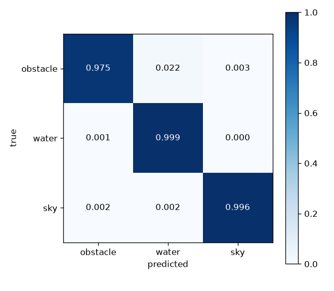
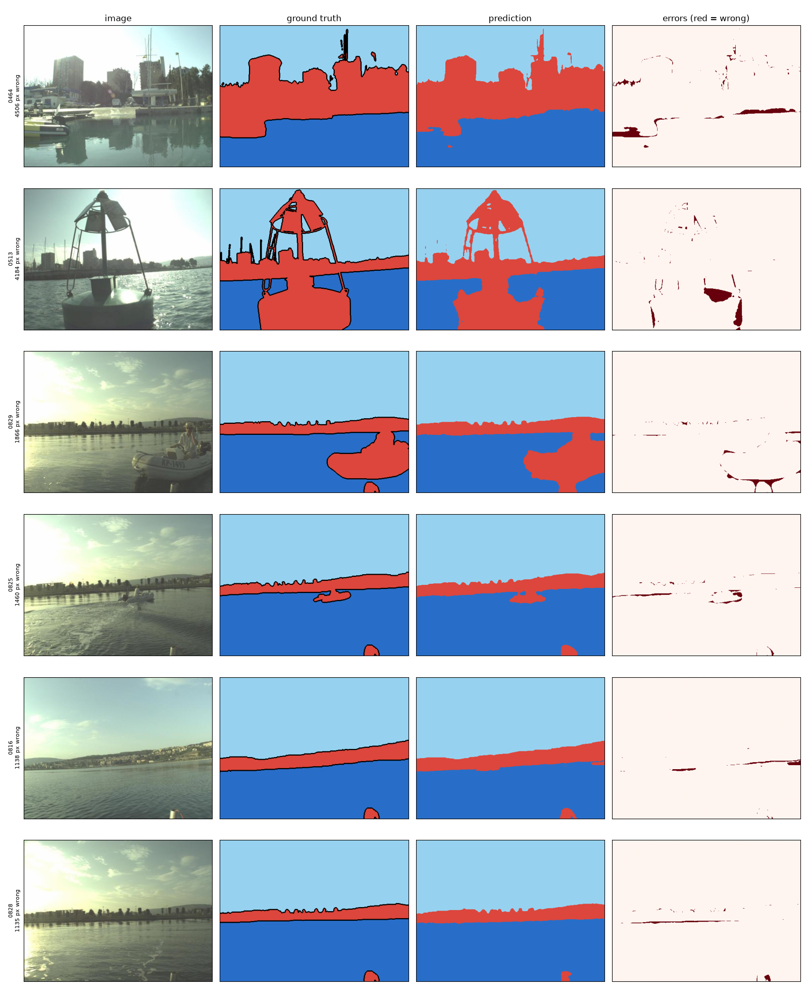
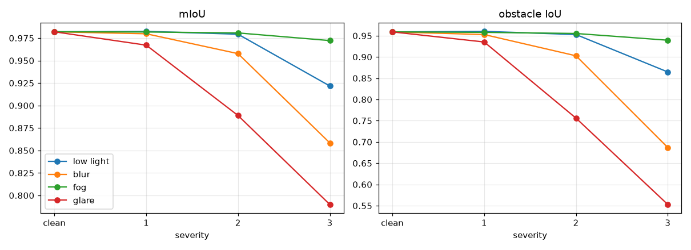
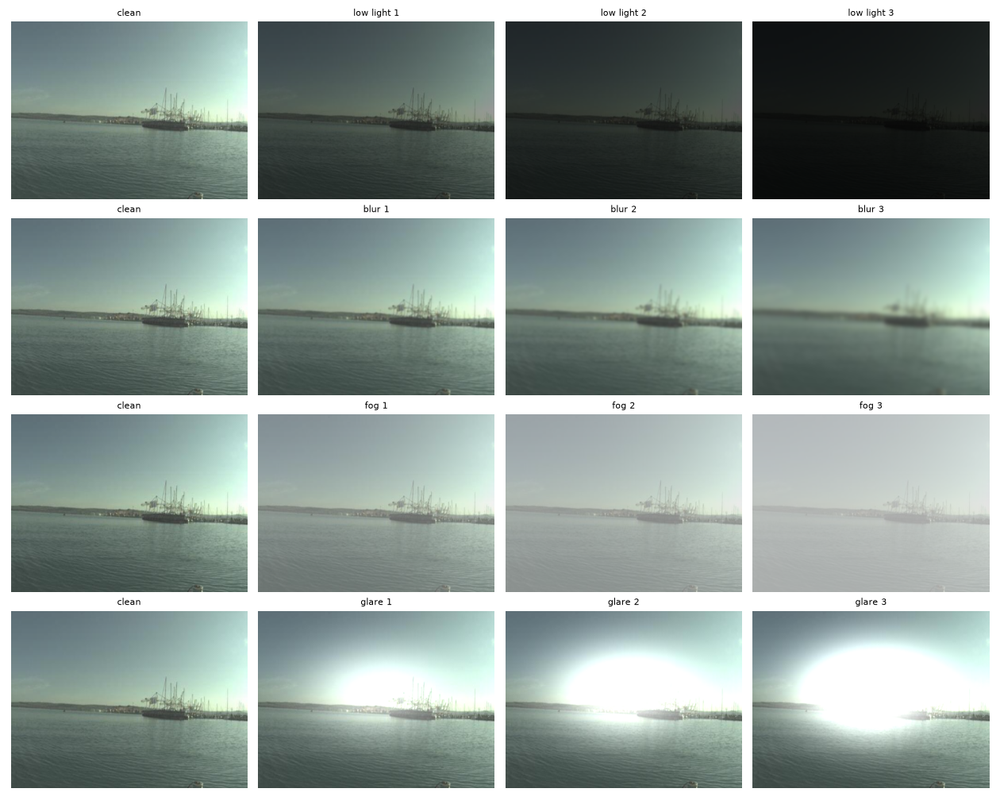

# USV Water Segmentation on MaSTr1325

Semantic segmentation (obstacle / water / sky) for an unmanned surface vehicle (USV), built by fine-tuning SegFormer-B0 in PyTorch.

The project goes beyond a single accuracy number: it uses a split that avoids near-duplicate frame leakage, breaks recall down by obstacle-region size, analyses the worst failures, stress-tests the model under synthetic corruptions, and benchmarks inference speed.

| | |
|---|---|
| Test mIoU | **0.982** (obstacle IoU 0.959, recall 0.975) |
| Small-region recall (test) | 0.837 (vs. 0.979 for large regions) |
| Most damaging synthetic corruption | strong glare: obstacle IoU 0.959 → 0.553 |
| Speed | 5.8 ms/frame (173 FPS), RTX 4050 Laptop GPU, forward pass only |

> **Read the limitations first.** All scores are in-distribution (same dataset as training), the stress tests are synthetic, and this is a single training run. See [Limitations](#limitations).

---

## Motivation

A USV needs to know where it can safely go. Segmenting every camera frame into water, sky, and obstacle produces a free-space map that can feed a costmap or planner. Unlike a detector, it does not need a fixed list of obstacle classes: anything that is not water or sky is flagged.

Water scenes are hard for vision. Glare, reflections, wakes, and small distant objects are common sources of error, which is why this is still an active research problem.

## Dataset

[MaSTr1325](https://vicos.si/resources/mastr1325/) (University of Ljubljana): 1325 images (384x512) captured from a small USV, with hand-annotated masks.

| raw label | meaning | share of pixels |
|---|---|---|
| 0 | obstacles and environment | 8.13% |
| 1 | water | 39.55% |
| 2 | sky | 50.28% |
| 4 | ignore region | 2.04% |

These shares were measured over all 1325 masks (`scripts/check_masks.py`). Class 0 includes the shoreline and land, not only floating objects, so its IoU is not a pure small-obstacle score. Label 4 is remapped to 255 and excluded from the loss and all metrics.

## Method

- **Split.** 1050 / 150 / 125 images (train / val / test). The images come from video sequences, so neighbouring frames are nearly identical and a random image-level split would leak near-duplicates into validation. Instead, the sorted file list is cut into blocks of 50 consecutive frames and the *blocks* are shuffled into the three splits (seed 42). This assumes filenames follow frame order. Split files are committed in `splits/` so results are reproducible. Because blocks can still come from the same sequences as training data, the split reduces leakage but does not remove it.
- **Model.** SegFormer-B0 (`nvidia/mit-b0`) with an ImageNet-pretrained encoder and a newly initialised 3-class head. The network outputs logits at 1/4 resolution, which are upsampled bilinearly to mask size before the loss.
- **Training.** AdamW, learning rate 6e-5, batch size 8, 20 epochs, cross-entropy with `ignore_index=255`, ImageNet normalisation, horizontal flip and brightness/contrast augmentation. The checkpoint with the best validation mIoU is kept. Single run, random seed not fixed.
- **Metrics.** Per-class IoU, precision, and recall, all derived from one confusion matrix with ignored pixels excluded.

## Results

### Test set (125 images)

| class | IoU | precision | recall |
|---|---|---|---|
| obstacle / environment | 0.9589 | 0.9829 | 0.9753 |
| water | 0.9915 | 0.9930 | 0.9985 |
| sky | 0.9955 | 0.9993 | 0.9962 |
| **mIoU** | **0.9820** | | |

Validation (150 images, used to select the checkpoint): mIoU 0.9918, obstacle IoU 0.9797. The validation score is slightly optimistic because the checkpoint was chosen on it; the test split was evaluated once at the end.



### Recall by size of obstacle region

For each connected region of ground-truth class 0, the fraction of its pixels the model recovers, grouped by region area. This is my own approximation of a small-object metric (not an official benchmark metric), with thresholds chosen for 384x512 images.

| region area | test regions | test recall | val recall |
|---|---|---|---|
| small (< 500 px) | 973 | 0.837 | 0.731 |
| medium (500 – 5000 px) | 73 | 0.953 | 0.946 |
| large (≥ 5000 px) | 104 | 0.979 | 0.992 |

Large regions are segmented almost perfectly; small ones are missed more often. Many of the small regions are probably thin fragments along edges rather than floating objects (see the failure analysis), so this should not be read as a pure small-buoy detection rate.

## Failure analysis

Errors are concentrated in a few images and are small in area. On the validation set the median image has 176 wrongly classified pixels (about 0.09% of the image) and the mean is 337. The two worst images (`0464.jpg`, `0513.jpg`) have about 4,500 and 4,200 wrong pixels (about 2%).



Inspecting the worst images, the errors fall into four groups:

1. **Boundary pixels.** Most error is a thin strip along the shoreline or water edge. The ground truth marks object outlines with the ignore label, which shows that annotation at edges is uncertain, so a large share of this error is probably label ambiguity rather than model failure. This has not been quantified.
2. **Reflections.** In `0464` and `0829`, errors cluster where boats or buildings are mirrored in the water.
3. **Backlit scene.** The largest compact error is in `0513`, a buoy photographed against strong sun. This is consistent with the glare sensitivity found in the stress test below, though a single image does not prove the link.
4. **Thin structures and small objects.** Masts and small objects are partly missed, consistent with the lower recall on small regions.

Images `0816`, `0825`, `0828`, and `0829` all appear among the six worst and have neighbouring filenames, so they likely come from one stretch of footage with similar conditions (low sun, hazy sky, distant shoreline).

## Robustness (synthetic stress test)

Corruptions are applied to the test images before normalisation, then the unchanged model is evaluated. Obstacle IoU (clean: 0.959):

| corruption (severity values) | sev. 1 | sev. 2 | sev. 3 |
|---|---|---|---|
| low light (×0.6 / 0.35 / 0.15) | 0.960 | 0.953 | 0.865 |
| fog (haze 0.3 / 0.5 / 0.7) | 0.958 | 0.955 | 0.939 |
| blur (σ = 1 / 2 / 4 px) | 0.953 | 0.903 | 0.687 |
| glare (0.5 / 0.8 / 1.2) | 0.935 | 0.756 | 0.553 |

mIoU at severity 3: fog 0.972, low light 0.922, blur 0.858, glare 0.790 (clean: 0.982).




The model tolerates fog and mild darkening but degrades sharply under strong blur and strong glare. Notes on interpretation:

- The corruptions are **synthetic approximations**: uniform haze (not depth-dependent), a single Gaussian glare blob, Gaussian blur, and darkening. Real fog and sun glitter look different.
- Severity levels were chosen by hand and are **not comparable across corruption types**; compare each curve to its own clean baseline.
- At glare severity 3 the blob centre is fully saturated by construction (intensity added then clipped), so image content is destroyed there and no model could recover it. The drop partly reflects lost information, not only model weakness.
- Training used brightness/contrast augmentation, which may explain part of the low-light robustness; this was not tested separately.

## Speed

5.8 ms/frame (173 FPS) on an NVIDIA GeForce RTX 4050 Laptop GPU, batch size 1, 384x512 input, fp32, **model forward pass only** (no image loading, upsampling, or argmax). Not measured on embedded hardware, which would be slower.

## Limitations

- Validation and test sets come from the same dataset as the training data (in-distribution); no cross-dataset evaluation has been done.
- Class 0 mixes obstacles with shoreline and land, so its IoU is not a pure obstacle score.
- Single training run, random seed not fixed, no confidence intervals. Small differences should not be over-interpreted.
- The small-region recall metric is a custom approximation, and the boundary-ambiguity explanation for errors is a hypothesis from visual inspection.
- The robustness tests are synthetic.

## Next steps

- Cross-dataset evaluation (MODS / LaRS) to measure domain shift.
- Boundary-tolerant IoU, to quantify how much error is edge ambiguity.
- Augmentation targeted at blur and glare, with before/after on the same stress test.
- Uncertainty maps (e.g. softmax entropy) to flag pixels where the model is unsure.
- ONNX / TensorRT export and a ROS2 node tested in a Gazebo USV simulation.

## Repository structure

```
src/        dataset.py, model.py, train.py, evaluate.py, metrics.py, robustness.py
scripts/    data_split.py, check_masks.py, visualize_batch.py, predict_samples.py,
            benchmark_speed.py, overfit_test.py
splits/     train.txt, val.txt, test.txt
results/    metrics (json) and figures
```

Datasets and model weights are not tracked by git (`data/`, `checkpoints/`).

## Reproduce

```bash
pip install -r requirements.txt

# download MaSTr1325 from https://vicos.si/resources/mastr1325/
# and place it in data/MaSTr1325/{images,masks}

python3 scripts/data_split.py                  # writes splits/*.txt
python3 src/train.py --epochs 20               # saves checkpoints/best.pt
python3 src/evaluate.py --split test           # per-class IoU, precision, recall
python3 src/robustness.py                      # synthetic stress test
python3 scripts/predict_samples.py --split val # worst-case overlays
python3 scripts/benchmark_speed.py             # forward-pass FPS (needs a CUDA GPU)
```

## References

- Bovcon et al., *The MaSTr1325 dataset for training deep USV obstacle detection models*, IROS 2019.
- Xie et al., *SegFormer: Simple and Efficient Design for Semantic Segmentation with Transformers*, NeurIPS 2021